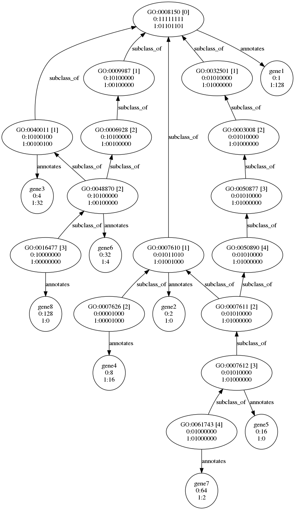

# smeargol

`smeargol` is a tool for non-redundantly assigning gene count data to Gene Ontology terms associated with the genes. It is based on ideas from [Fruzangohar _et al._](https://journals.plos.org/plosone/article?id=10.1371/journal.pone.0170486).

`smeargol` distributes count data across the Gene Ontology DAG provided and writes tsv files holding the GO terms and distributed counts, and plot files of singular values. The files have their roots and depths specified in the file names. It logs gene identifiers that do not have GO term annotations to stderr. The graph analysis assumes Ensembl gene identifiers and Gene Ontology graph structure.

The figure below shows a portion of the biological process DAG from the GO. Each node is marked with the GO identifier, the distance from the root in square brackets, and a list of bit vector showing which genes have been painted onto the node for each of the samples, 0 and 1. The gene nodes show the counts for the gene in each sample.



The bit vectors are then extracted into a matrix for each depth of the DAG. For example for the DAG shown, the level 2 matrix for sample 0 would look like this.

```
      GO:0003008 GO:0006928 GO:0007611 GO:0007626 GO:0048870
gene1      0          0          0          0          0
gene2      0          0          0          0          0
gene3      0          0          0          0          0
gene4      0          0          0          1          0
gene5      1          0          1          0          0
gene6      0          1          0          0          1
gene7      1          0          1          0          0
gene8      0          1          0          0          1
```

The actual counts obtained from transcriptomic (or other) analysis are then distributed over the painted nodes. To identify the most appropriate level to perform a comparison with, each GO level's matrix is decomposed to find the number of singular values above the noise floor. The GO level with the highest rank thresholded for noise is then chosen.

The input counts file is a tab-delimited file with the first column being Ensembl gene ID (ENSG00000000000) and remaining columns being count data. The first row is expected to be labelled with the first column being Geneid and the remaining columns holding the names of the samples.

The Gene Ontology is required to be in Owl format. The file can be obtained from http://current.geneontology.org/ontology/go.owl.

The ENSG to GO mapping is expected to be in RDF N-Triples or N-Quads in the form:

```
<obo:GO_0000000> <local:annotates> <ensembl:ENSG00000000000> .
```

for each GO term to Ensembl gene annotation.

All input files are expected to be gzip compressed and user output is written uncompressed to the filesystem. Debugging output is written to standard output.
